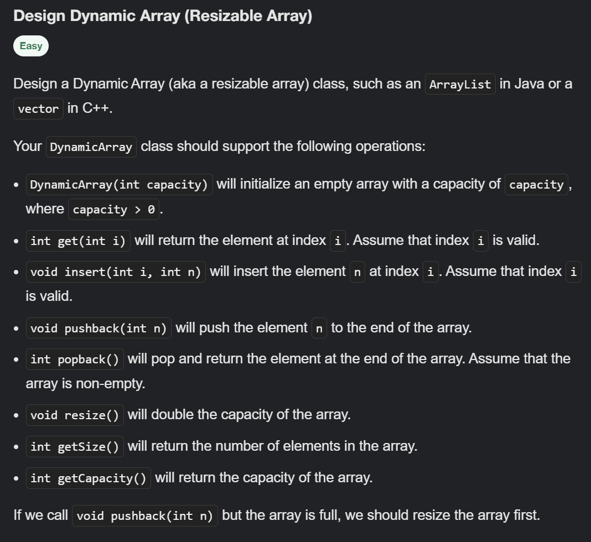
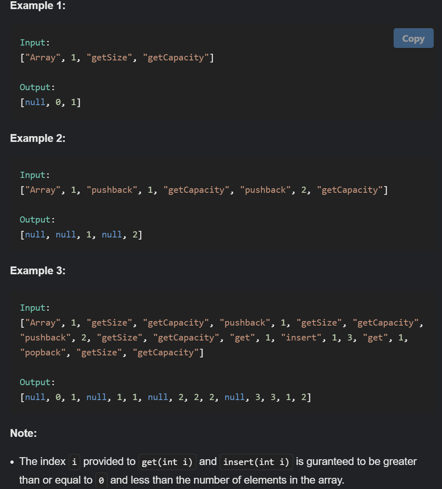
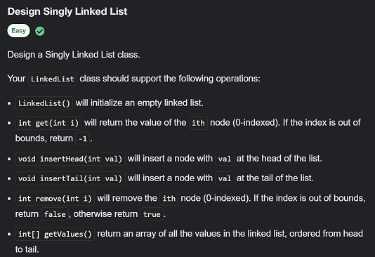
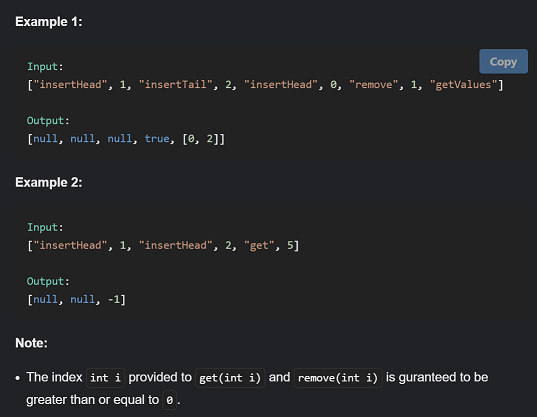
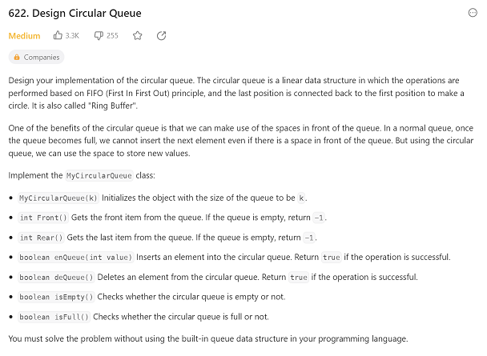
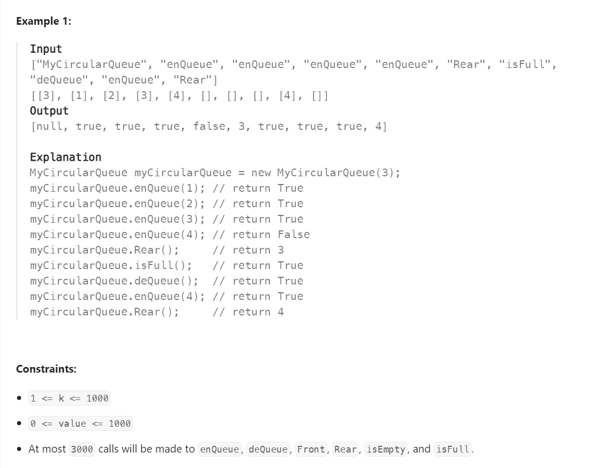

## 01 Design Dynamic Array (Resizable Array)  `[Easy] `     [01](01.py)

### Example:    

## 02 Design Singly Linked List   `[Easy]`  [02](02.py)

### Example:    

## 03 Design Double-ended Queue ---`[Easy]` [03](03.md)
### 03_alter Design Circular Queue  [03A](03_alter.py) - [video](https://www.youtube.com/watch?v=aBbsfn863oA)

### Example:    

## 04 Design Binary Search Tree ---`[Medium]`

## 05 Design Hash Table ---`[Medium]`

## 06 Design Heap ---`[Medium]`  

## 07 Design Graph ---`[Medium]`  

## 08 Design Disjoint Set (Union-Find) ---`[Medium]`     

## 09 Design Segment Tree ---`[Hard]`    

## 10 Insertion Sort ---`[Easy]`

## 11 Merge Sort ---`[Medium]`     

## 12 Quick Sort ---`[Medium]`     

## 13 Dijkstra's Algorithm ---`[Medium]`   

## 14 Prim's Algorithm ---`[Hard]`   

## 15 Kruskal's Algorithm ---`[Hard] `   
