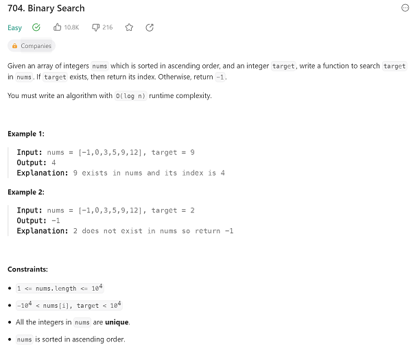
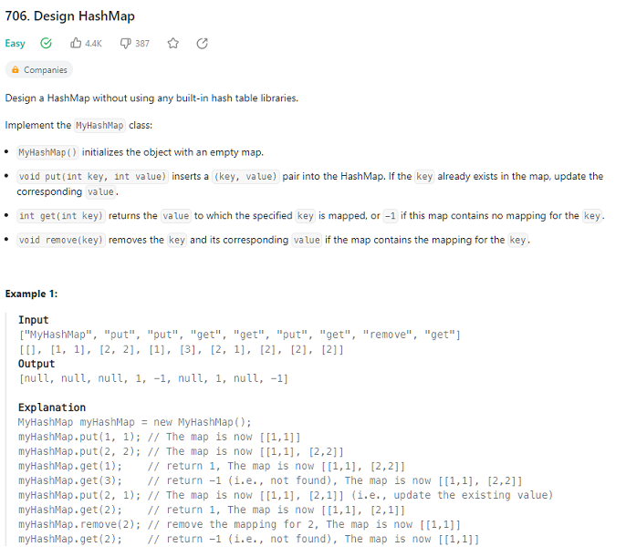
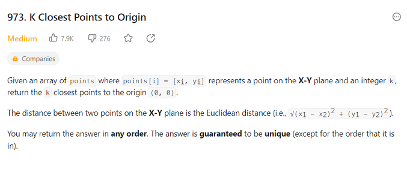
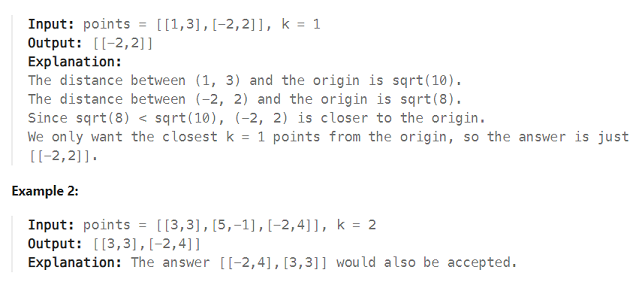
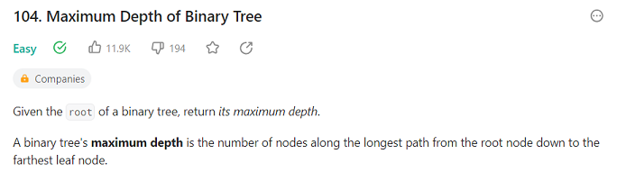
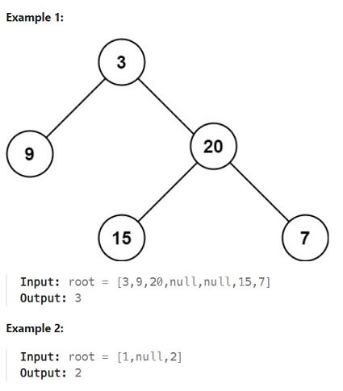
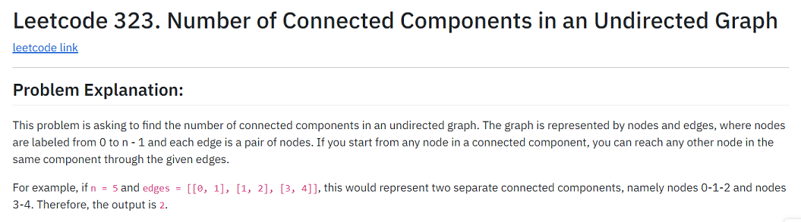
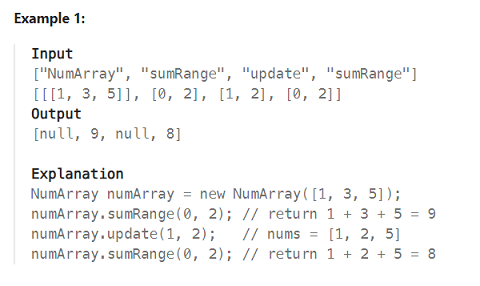

# Part1_设计数据结构 [URL](https://neetcode.io/practice)

## 01 Design Dynamic Array (Resizable Array)  `[Easy] `    

### Solution: [01](01.py)

 

## 02 Design Singly Linked List   `[Easy]`  

### Solution: [02](02.py)

 

## 03 Design Double-ended Queue ---`[Easy]` 

- Explanation: [03](03.md)

## 03_alter Design Circular Queue ---`[Medium]`  

### Solution: [03A](03_alter.py) - [video](https://www.youtube.com/watch?v=aBbsfn863oA)

[Leetcode 622](https://leetcode.com/problems/design-circular-queue/)   
 

## 04 Design Binary Search Tree ---`[Medium]`

- Refence: [ref1](https://www.geeksforgeeks.org/binary-search-tree-data-structure/)  

- Tip: [tip1](04_tip.md)

## 04_alter Binary Search ---`[Easy]`

### Solution: [04A](04_alter.py) - [video](https://www.youtube.com/watch?v=s4DPM8ct1pI&list=PLot-Xpze53leNZQd0iINpD-MAhMOMzWvO&index=2)

[Leetcode 704](https://leetcode.com/problems/binary-search/)  

## 05 Design Hash Table ---`[Medium]`

- Explanation: [05](05.md)

## 05_alter Design HashMap ---`[Easy]`

### Solution: [05A](05_alter.py) - [video](https://www.youtube.com/watch?v=cNWsgbKwwoU)

[Leetcode 706](https://leetcode.com/problems/design-hashmap/description/)  

## 06 Design Heap ---`[Medium]`  

- Explanation: [06](06.md)

- Basic: [06_basic](06_basic.py)

## 06_alter K Closest Points to Origin ---`[Medium]`

### Solution: [06A](06_alter.py) - [video](https://www.youtube.com/watch?v=rI2EBUEMfTk&ab_channel=NeetCode)

[Leetcode 973](https://leetcode.com/problems/k-closest-points-to-origin/)  
 

## 07 Design Graph ---`[Medium]`  

- Explanation: [07](07.md) - [video](https://www.youtube.com/watch?v=utDu3Q7Flrw&list=PLot-Xpze53ldBT_7QA8NVot219jFNr_GI&ab_channel=NeetCode)

## 07_alter Maximum Depth of Binary Tree ---`[Easy]`

### Solution: [07A](07_alter.py) - [video](https://www.youtube.com/watch?v=hTM3phVI6YQ&ab_channel=NeetCode)

[Leetcode 104](https://leetcode.com/problems/maximum-depth-of-binary-tree/description/)  
 

## 08 Design Disjoint Set (Union-Find) ---`[Medium]`     

## 08_alter Number of Connected Components in an Undirected Graph ---`[Medium]`

### Solution: [08A](08_alter.py) - [video](https://www.youtube.com/watch?v=8f1XPm4WOUc&ab_channel=NeetCode)

[Leetcode 323_premium](https://algo.monster/liteproblems/323)  

## 08_alter Number of Provinces ---`[Medium]` ---TODO
[Leetcode 547](https://leetcode.com/problems/number-of-provinces/description/)  

## 09 Design Segment Tree ---`[Hard]`    

- Basic: [09_basic](09_basic.py)

## 09_alter Range Sum Query - Mutable ---`[Medium]`

### Solution: [09A](09_alter.py) - [video](https://www.youtube.com/watch?v=rYBtViWXYeI&ab_channel=HuaHua)

[Leetcode 307](https://leetcode.com/problems/range-sum-query-mutable/)  
 

# Part2_基本排序算法  

The essence of sorting algorithms is to reduce the number of **inverse pairs**.

## 10 Insertion Sort ---`[Easy]`

- Basic: [10_basic](10_basic.py)

### Solution: [10](10.py) - [video](https://www.youtube.com/watch?v=PqPG7WGwGlU)

 

## 11 Merge Sort ---`[Medium]`     

- Basic: [11_basic](11_basic.py)  
  
- Tip: [11_tip](11_tip.md)
  
## 11_alter Merge Sorted Array ---`[Easy]`

### Solution: 

 - 自己的方法：[11_alter1_1](11_alter1_1.py)

 - 改进版：[11_alter1_2](11_alter1_2.py)

 - [video](https://www.youtube.com/watch?v=P1Ic85RarKY) :  [11_alter1_3](11_alter1_3.py)

[Leetcode 88](https://leetcode.com/problems/merge-sorted-array/)  

## 11_alter Sort List ---`[Medium]`

### Solution: 

- 自己的方法：[自己的方法](11_alter2.py)
  
- [video](https://www.youtube.com/watch?v=TGveA1oFhrc) : [11_alter2_2](11_alter2_2.py)

[Leetcode 148](https://leetcode.com/problems/sort-list/)  

## 12 Quick Sort ---`[Medium]`     

- Basic: [12_basic](12_basic.py)  
  
- py special: [12_basic2](12_basic2.py)

# Part3_图算法
## 13 Dijkstra's Algorithm ---`[Medium]`   

## 14 Prim's Algorithm ---`[Hard]`   

## 15 Kruskal's Algorithm ---`[Hard] `   

# Reference:

1. [URL](https://neetcode.io/practice)
2. [old URL](https://docs.google.com/spreadsheets/d/1A2PaQKcdwO_lwxz9bAnxXnIQayCouZP6d-ENrBz_NXc/edit#gid=0)
3. [THE Python Tutorial](https://docs.python.org/3.11/tutorial/index.html)
4. [Python Tutorial_geeks](https://www.geeksforgeeks.org/python-programming-language/?ref=shm_outind)
5. [VisuAlgo](https://visualgo.net/zh)
6. [Visually Debug Code](https://pythontutor.com/python-compiler.html#mode=edit)
7. 
8. 
9. 
10. 